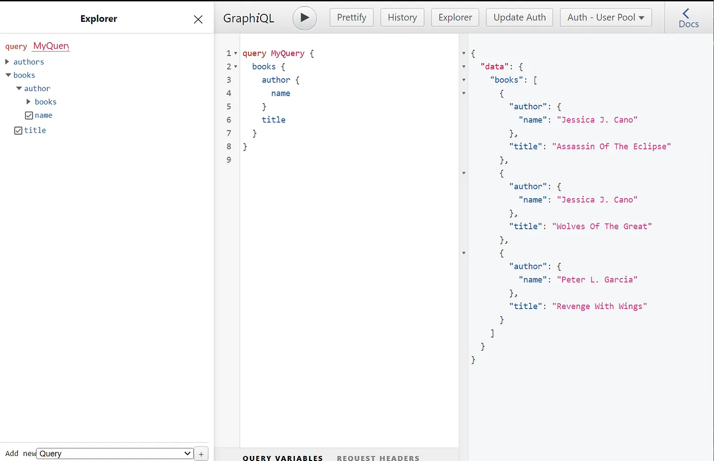

---
tags:
  - AWS
  - AppSync
  - GraphQL
canonicalUrl: >-
  https://awstip.com/boost-local-development-with-appsync-simulator-c32487ec12
coverImage: https://github.com/DevWaveX/appsync-simulator-starter-kit/raw/main/article/cover.png
publications:
  - platform: devTo
    published: true
  - platform: hashnode
    publicationId: 62019a434efba97010a97bb9
---

# Boost local development with AWS AppSync Simulator🚀✨

Hi there! 👊

In this article I will explain you how to simulate AWS AppSync in local when you are not fully using Amplify or Serverless framework.

## In which case you shouldn’t read this article?

If you are fully using **Amplify CLI**, you should be able to use **amplify mock** command to simulate AppSync so… you can stop reading here ^^

If you are using **Serverless**⚡ \***\*framework, you should be able to use the **serverless-appsync-simulator\*\* plugin to cover your need.

In any other cases, you are at the right place :)

## If you are still reading, let’s go!

What we will do through this article is building an **Amplify AppSync simulator **without using Amplify CLI at all. In fact, we will only pick the simulator which is interesting for us and use it.

We will configure the simulator with a simple GraphQL Schema (Books and authors data model) and Lambda data sources in charge of retrieving data.

Here is the model, dataset and GraphQL schema we will use:

<!-- CODE:START file=../src/types/author.ts -->
<!-- CODE:END -->

<!-- CODE:START file=../src/types/book.ts -->
<!-- CODE:END -->

<!-- CODE:START file=../src/data/authors.ts -->
<!-- CODE:END -->

<!-- CODE:START file=../src/data/books.ts -->
<!-- CODE:END -->

<!-- CODE:START file=../src/schema.gql -->
<!-- CODE:END -->

### Pre-requisites

You have **node **and **npm **installed.
You have a simple **typescript** project ready! (package.json with typescript and @types/node dependencies, tsconfig.json properly configured…)

### Add dependencies

First we will add some **development dependencies** in our project

```sh
npm install --save-dev ts-node ts-node-dev @types/aws-lambda
```

**ts-node-dev**: It will help us to start the simulator and have hot reload capabilities

**@types/lambda**: Add some Typescript types related to AWS Lambda that I will use in this example

And, finally, we will add the famous **Amplify AppSync simulator** package

```sh
npm install amplify-appsync-simulator
```

### Create lambda handlers for resolvers

We will build handlers for our query operations and to resolve nested fields.

<!-- CODE:START file=../src/resolvers/queryAuthors.ts -->
<!-- CODE:END -->

<!-- CODE:START file=../src/resolvers/queryBooks.ts -->
<!-- CODE:END -->

<!-- CODE:START file=../src/resolvers/authorBooks.ts -->
<!-- CODE:END -->

<!-- CODE:START file=../src/resolvers/bookAuthor.ts -->
<!-- CODE:END -->

### Create request/response mapping templates

Now we will create VTL files for our request and response mapping templates. These VTL files will have to be passed to the simulator as string so I created a function to read them from the filesystem.

<!-- CODE:START file=../src/vtl/lambdaRequestMappingTemplate.vtl -->
<!-- CODE:END -->

<!-- CODE:START file=../src/vtl/lambdaResponseMappingTemplate.vtl -->
<!-- CODE:END -->

### Build the AppSync Simulator 🚀

Here is the interesting part! We will create the AppSync Simulator with all the configuration we have prepared before.

💡Tips: One interesting aspect is that, if you are using AWS CDK, you can share some pieces between the way you configure the simulator and the way your build your constructs.

 <!-- CODE:START file=../src/main.ts -->
<!-- CODE:END -->

And we can finally run our simulator ✨

    ➜ npx ts-node-dev src/main.ts

    [INFO] 13:46:46 ts-node-dev ver. 2.0.0 (using ts-node ver. 10.9.1, typescript ver. 4.9.4)
    🚀 App Sync Simulator started at http://localhost:4000/graphql

### Testing our GraphQL API

By accessing [http://localhost:4000](http://localhost:4000,)/, you can access directly the built-in Amplify GraphiQL Explorer



## AppSync Simulator Starter Kit

As usual in my articles, the related repository 😉
[**GitHub - DevWaveX/appsync-simulator-starter-kit: Starter kit for using AppSync simulator**
*Starter kit for using AppSync simulator. Contribute to DevWaveX/appsync-simulator-starter-kit development by creating…*github.com](https://github.com/DevWaveX/appsync-simulator-starter-kit)

I hope you enjoyed reading from me! See you soon 🤘
